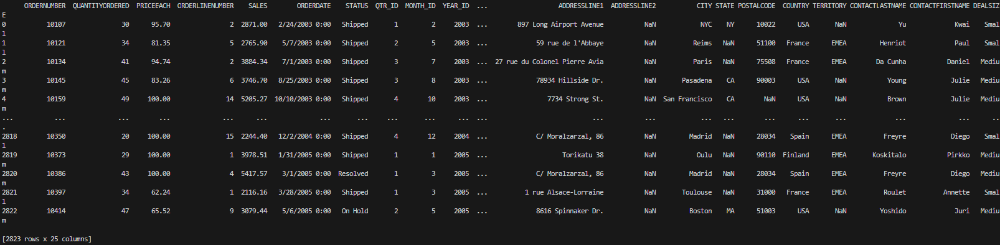
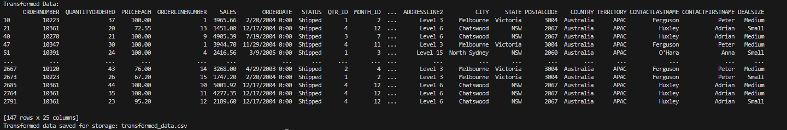

## ETL Pipeline Python

## Project

This is an ETL pipeline built in python to take a flat file and be able to transform the data and load it for it to be ready for storage. This will be further developed once databases are learnt and will be stored in postgresql and i will also include some sort of scheduling/automation via apache airflow

## Features

Extracts flat files such as a CSV
Tranforms data by checking for duplicates, NaN values, or any data discrepancies
Loads the data back ready for storage as a CSV
Pipeline is also tested through pytest

## Dependencies

Python 3.7
Pandas
Numpy
pytest

## Setup

1. Clone repository
2. Install dependencies
3. To run script use command python "python pipeline.py"
